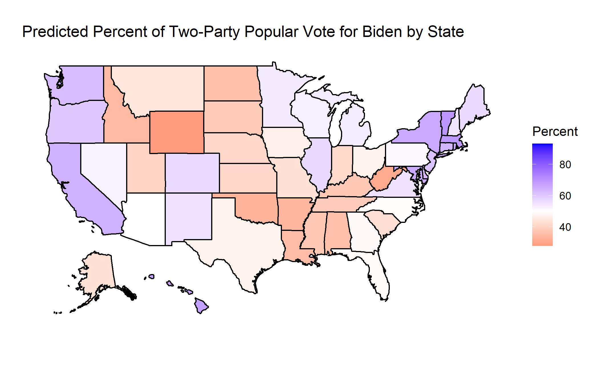
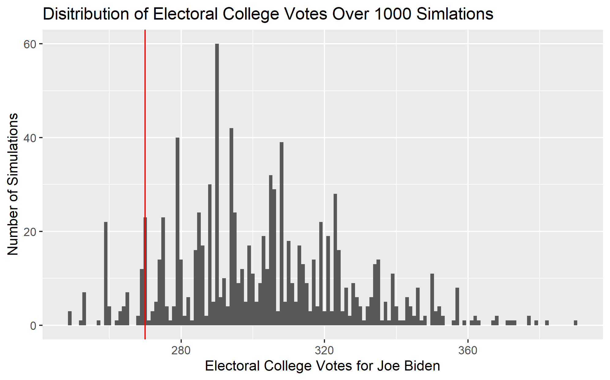

## Final Election Prediction - 11/1/2020

My final predictions for the 2020 US Presidential election are as follows:

*National Two-Party Vote Percent:*
- Joe Biden: 52.465%
- Donald Trump: 47.535%

*Electoral College Votes:*
- Joe Biden: 290
- Donald Trump: 248

*Probability of Winning:*
- Joe Biden: 93.3%
- Donald Trump: 6.7%



### Formula for the Model

These predictions were generated with a bivariate regression model that uses polling average data and prediction market data from the 2016 election to predict the share of the two-party popular vote by state. The formula for this model is as follows:

```
pv2p ~ avg_poll_2p + poly(log_price, 3)
```

In this model, `pv2p` is the percent of the two-party popular vote for a candidate, `avg_poll_2p` is the polling average, and `log_price` is the market price on PredictIt.org, a prediction market website. To simplify the model, third party candidates were eliminated from consideration by adjusting both the polling averages and market prices to be in terms of only the two major parties. All data used to train the model came from 2016.

It is also important to note that market price is included in the regression as a third-degree polynomial term. Since market prices tend to drift towards the very high and very low ends of the \$0 to \$1 price scale, plotting market prices against vote percent for the 2016 election reveals that the data does not follow a linear pattern, and thus the polynomial term is added to improve the model fit. However using a third-degree polynomial regression can result in a predicted decrease in vote percent as the market price increases above $0.50. To adjust for this while still using the original data, the model instead uses the logarithm of the market prices. This adjustment not only corrects for this dip, but it also seems to slightly increase the R-squared value of the model. 

Another important thing to note about this model is that it is trained with data from a specific party in 2016, and thus can only predict the vote share for that party in 2020. Since the model includes a polynomial term, plugging in data for both candidates into the same model results in two predictions that do not add up to 100%. Thus, a separate model is generated to predict the vote share for each parties. Since the two sets of data are both in terms of only two parties and are complementary, the predictions from these two models are also complementary and add up to 100%. Any references to the model from this point on will be specifically regarding the Democratic model, from which a prediction for the Republican vote share can be generated by subtracting from 100%. 

There are several reasons why these two variables, prediction market price and polling average, where chosen to make the prediction. First of all, the abnormality of 2020 makes the use of fundamental predictors markedly more challenging. The economy is a good example of this. In past years, economic variables like Q2 GDP growth, the change in real disposable personal income, and stock market growth in the months before the election have been powerful predictors of the election outcome. This year, however, these different variables have reached levels that fall beyond the scope of models based on historical economic data, leading to extreme and often contradictory predictions (see my blog post titled “The Economy and the Election”). The two variables used in this model both incorporate the fundamentals, as they reflect public opinion of the candidates and the candidates’ chances of winning the election, but they still fit models generated with historical data. 

In addition, prediction market price and the polling average both seem to be strong predictors of the vote percent by themselves, and the fit of the model improves when the two variables are used together (see my blog post titled “Adding Polling Data”). 

### National Predictions from State Estimates

This model uses state-level data from the 2016 election to predict the results of the 2020 election in each state. With the predictions made on a state by state basis, a national prediction can be made by aggregating the results. To do so, the predicted vote share in each state is used to calculate a number of predicted votes for a candidate in the state. The intermediary step in this calculation is to predict the voter turnout in the state using the population and the average turnout rate of the 1980-2016 presidential elections. With the predicted number of voters and vote percent, the number of voters for a candidate in each state can be calculated. To calculate a national vote percent, the total number of votes for a candidate is divided by the total number of voters. 

Similarly, the electoral college votes are allocated to the candidate that received over 50% of the two-party popular vote in the state. If the sum of the electoral college votes is greater than or equal to 270, that candidate wins the election.

### Coefficients for the Model

Since this is a multivariate regression model, there are multiple coefficients that can be interpreted. First, there is the intercept of the regression, which is -3.020. This can be interpreted as the percent of the two-party popular vote a candidate could expect to receive if they had a 0% polling average and their prediction market price was $0. Since you can not receive a negative share of the vote, this model will likely not perform well for candidates who have market and poll values that would put them in this range. Next there is the coefficient for the polling average, which is 1.016. This can be interpreted as the average associated increased in two-party vote percent for a one percentage point increase in the polling-average, holding market prices constant.

With the market price data being included as a third-degree polynomial term, there are three coefficients associated with market price. However, these coefficients can not be as easily interpreted as the one for polling average, as the relationship between prediction market price and vote percent changes as the market price increases. 

### Model Validation

This model has a R-squared value of 0.9777 and an adjusted R-squared value of 0.9758. The root mean squared error for this model using in-sample data is 1.91. A leave-one-out cross validation with 1,000 resamplings of the data produces a root mean squared error of 1.79. These values all indicate that the model fits the 2016 data very well, and they suggest that the model has the potential to be a strong predictor of the election results in 2020. 

### Prediction Uncertainty

Since the model itself makes predictions for each state, there is no straightforward way to generate a prediction interval for the national two-party vote percent. However, one way to capture the uncertainty of this prediction is to make a probabilistic prediction based on the state results. With the predicted vote share and the corresponding prediction interval produced by the model, a distribution of possible vote shares can be generated for each state. By repeatedly sampling each state’s distribution, I simulated 1,000 possible election outcomes, each of which produces a electoral college vote count. 

I have plotted one such set of election outcomes for Joe Biden below, where the 270 electoral vote threshold is shown as the vertical red line. Since a candidate must win at least 270 electoral college votes to win the election, then the share of simulations where this is true can also be thought of as the probability of Biden winning the election. In this case, Joe Biden has a 93.3% chance of winning the election. 




