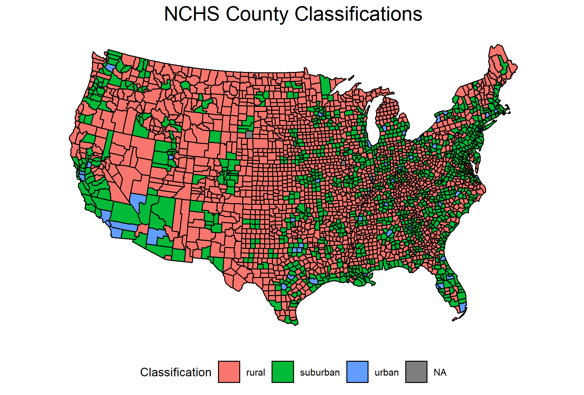
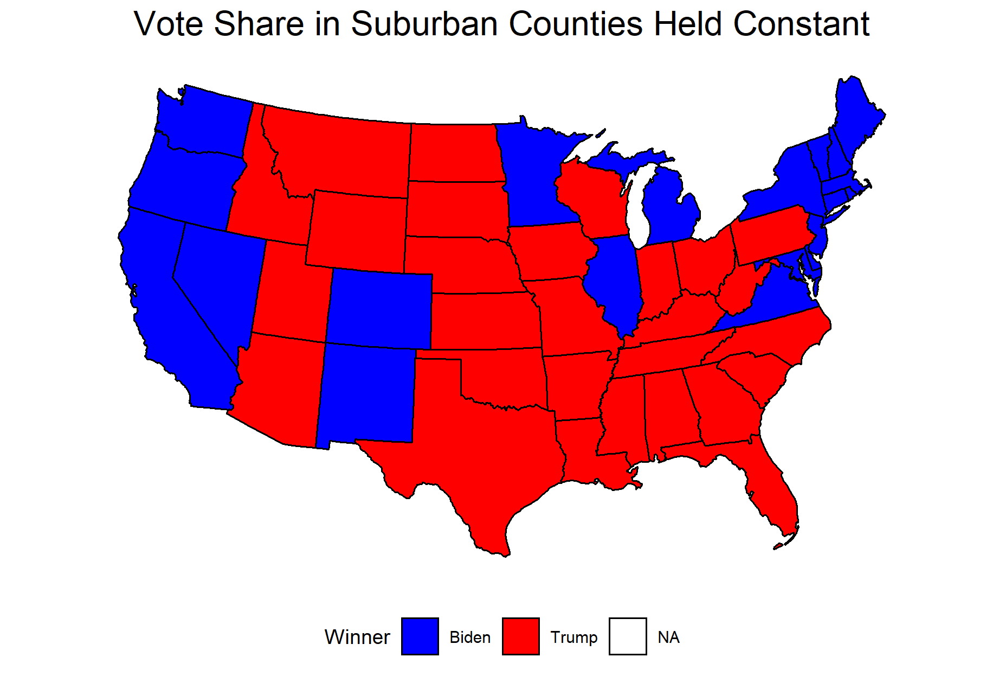
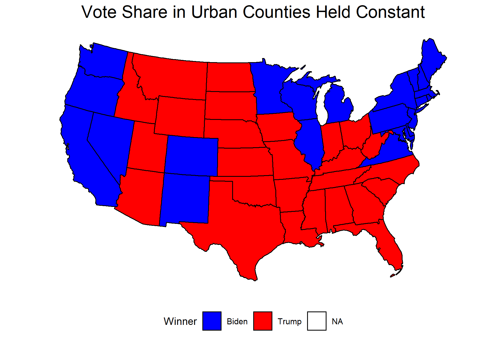
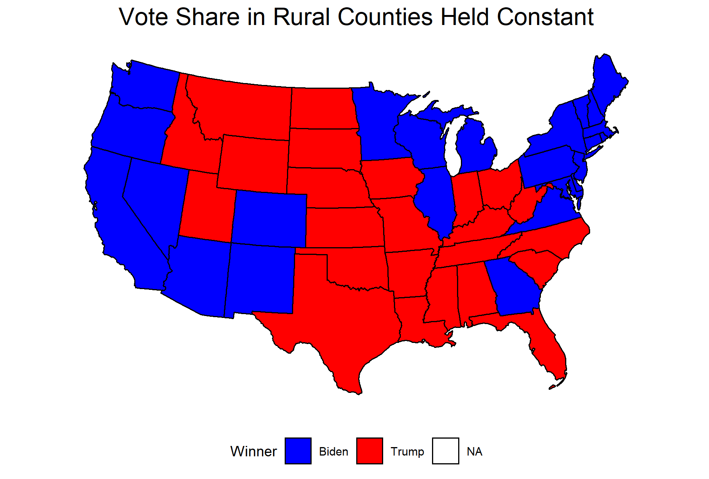

### Election Narratives: The Suburban Vote - 12/10/2020

Unsurprisingly, the suburbs turned out to be a key component of the 2020 presidential election. Even before the election, the candidates recognized the importance of winning over suburban voters, as both Donald Trump and Joe Biden targeted suburban areas with campaign stops and their rhetoric. In the weeks after the election, the suburbs have remained a popular topic, as many political pundits and journalists have made claims about how Biden won because of the support he received from suburban voters. An example of this narrative appearing in the media is this Bloomberg article titled [“How Suburbs Swung the 2020 Election”](https://www.bloomberg.com/graphics/2020-suburban-density-election/).

Although journalists and pundits have already begun to compile the data in articles like this one, I did not find myself particularly convinced after reading them. For example, the Bloomberg article describes how population density is correlated with Democratic vote share, but its arguments about how the suburbs allowed Joe Biden to win the presidency were not especially compelling. As a result, I decided to dig into this question myself to gain a better understanding of the role the suburbs played in the 2020 election.

To explore this media narrative about the suburbs, it may be easier to rephrase it in a way that is more concrete and easier to quantify: if Biden’s support in suburban counties remained at the same level as Hillary Clinton in 2016, he would have lost the election. What would we expect to see in the data if this was true? First of all, we would expect to see that the Democratic candidate for president received a larger share of the vote in suburban counties in 2020 as compared with 2016. Secondly, we would expect to see that Joe Biden would have failed to win crucial swing states like Pennsylvania, Michigan, and Wisconsin if support for the Democratic candidate remained constant from 2016. Finally, we would expect to see that the election outcome would have remain unchanged if the urban or rural vote shares are held constant instead of the suburban vote share. With these three boxes checked, we will have evidence that the change in the suburban vote allowed Joe Biden to win the presidential election.

Since it becomes increasingly difficult to classify an area as urban, rural, or suburban as the land area increases, I wanted to use as localized data as possible for the election results when conducting my analysis of suburban voters. Unfortunately, the data that has been released thus far does not seem to include any areas smaller than the state county. Although you may have a very clear idea of what the suburbs look like, actually making that distinction for each county is complicated because of the lack of an objective definition of the suburbs and the fact that a county can include areas that would be considered urban, rural, and suburban. There are two datasets I considered that used different methodologies to make these distinctions. The first dataset was produced by the National Center for Health Statistics, and it divides counties into six different categories based only on their population density. I then classified each county as rural, urban, or suburban based on the six categories can and the distinctions used by the [Pew Research Group](https://www.pewsocialtrends.org/2018/05/22/demographic-and-economic-trends-in-urban-suburban-and-rural-communities/). The second dataset was produced by a team of researchers from different organizations, and they used machine learning to predict the classification of counties based on a number of variables. The model used to make the predictions was trained with the classifications of different areas that were recorded by residents in a survey. 

Although the inclusion of other variables to create the machine learning data seems to make it more accurate in some cases (I would agree with its classification of my home county of Windham, CT as rural as opposed to suburban, which is what the NCHS data says), the dataset did not denote any counties in states like Michigan and Georgia as being urban, which is inaccurate and limits the ability of my analysis. As a result, I decided to use the classifications established by the NCHS to determine whether a county was urban, rural, or suburban. I have mapped these county classifications below to show how these different types of counties are distributed across the country.

With these classifications out of the way, I was then able to match the county classifications with the election results based on the FIPS code. As I mentioned before, the states that Biden flipped are the most important for this analysis, but it is also useful to have some background on how Biden did in these different types of counties more generally. On average, Biden’s percent of the two-party vote in rural, suburban, and urban counties, respectively, are as follows: 29.5%, 39.5%, and 67.2%. Considering the fact that so many journalists have claimed the suburbs are the reason he won, it is surprising that he received, on average, significantly less than half of the vote in suburban counties. However, what is likely more important in this case is the increase in support for the Democratic candidate relative to 2016. Biden’s average vote share in suburban counties in 2020 was 1.5 percentage points higher than Hillary Clinton’s was in 2016. For contrast, the average rural vote share didn’t change, while the average urban vote share increased by only 0.4 percentage points.

Although these data points are interesting, they do not tell us much about whether or not Biden won the election because of the suburbs. To determine if this is the case, we must specifically consider the states that won the election for Biden: Arizona, Georgia, Michigan, Pennsylvania, and Wisconsin. Had Joe Biden not flipped these states, he would not have won the election. For each of these states, I considered how the election would have played out had Joe Biden received the same percent of the vote in suburban counties as Hillary Clinton did in 2016. To do so, I multiplied the total two-party turnout from 2020 by the share of the two-party popular vote Hillary Clinton and Donald Trump received in 2016. This allowed me to simulate what the election would have looked like in each state had the suburbs voted the same way as they did in 2016, while still considering the increase in turnout in 2020. I then compared these predicted vote counts for Biden and Trump to determine who would have won each state under these circumstances.

The results were not especially surprising: had suburban counties voted the same way as they did in 2016, Joe Biden would have lost Arizona, Georgia, Pennsylvania, and Wisconsin. The only state he would have won regardless was Michigan, but a victory in this state alone would not have allowed him to win the electoral college. However, it would be a mistake to end my analysis there and conclude that the suburbs alone led Joe Biden to victory. It is also important to consider how changes in the urban and rural votes impacted the outcome of the election in each of these key states. After repeating the same process with the urban and rural counties, I found that Joe Biden would have still won the election if urban and rural counties voted the same way as they did in 2016. Although he would have lost Georgia and Arizona if the urban vote remained constant, he would have won Pennsylvania, Michigan, and Wisconsin, leaving him with exactly 270 electoral votes. The change in the rural vote did not seem to impact his election at all, as he would have won all five states if rural counties voted the same way as they did in 2016. 

To visualize these differences, I have mapped what the election results would have looked like under the different circumstances. Since I only performed this analysis for states that had at least one rural, urban, and suburban county, some states do not have any predicted results, so I just used the actual results for those states. Interesting, of the 29 states that did have all three types of counties, the only ones that had varied results under the different circumstances were the states that flipped to blue in 2020. 

These findings seem to reaffirm what many pundits have been discussing: the increase in support relative to 2016 in suburban counties carried Joe Biden to a victory in 2020. Even with the increase in support for Democrats in urban areas, especially in the states of Arizona and Georgia, Joe Biden would likely have lost the election without the the increase in vote share in the suburbs. As noted earlier, Joe Biden did not, on average, receive a majority of the two-party popular vote in the suburbs. However, the significant increase in votes for Democrats relative to 2016 pushed him over the threshold for victory in four of the five states that flipped this year. 

It is important to note that these are only preliminary findings based on county-level data. In order to make more definite conclusions about the role of the suburbs in this election, it would be useful to have election results for a more local level, such as town or census tract. If I had this data, I would be able to say with more certainty that the increase in the suburban vote won the election for Joe Biden. 

Although it is fun and interesting to consider these alternate realities where different portions of the population voted differently, it is also useful information for both research purposes and campaigns. In recent years, the divide between rural and urban voters has become increasingly clear, but it is less clear how suburban voters fit into this picture. My findings here support the idea that suburban voters can be thought of as “swing voters.” With urban and rural areas becoming increasingly partisan, more moderate voters in the suburbs will likely continue to decide elections. Based on this, urban and rural areas may see fewer political visits, as the candidates already know how those areas are going to vote. It is also interesting to consider how this will impact the platforms of the two parties: while Republicans have drifted further right and Democrats further left, it appears to be voters in the middle that are choosing the winners. 
