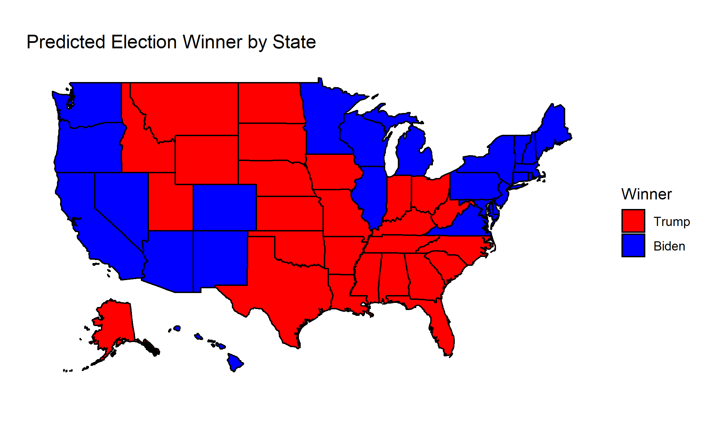
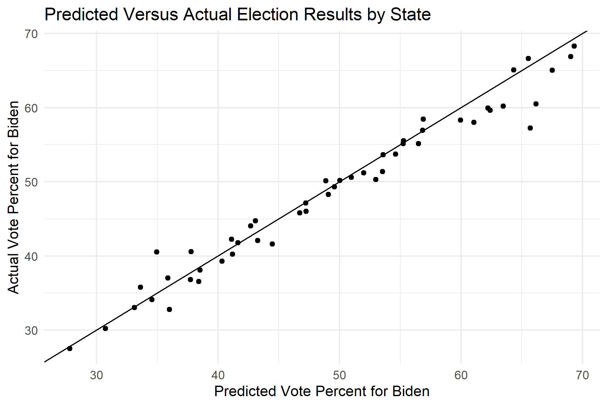
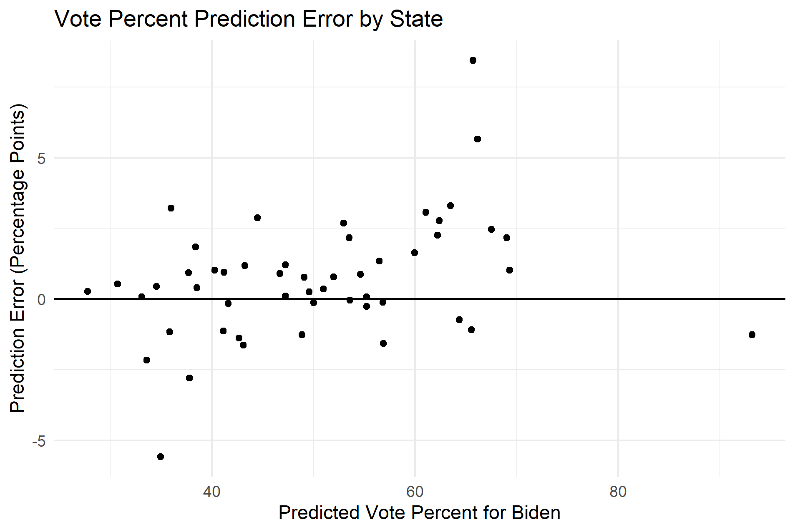

## Post-Election Reflection on Model - 11/23/2020

#### **Explanation of the Model**

The model I used to make my predictions for the 2020 presidential election was a bivariate regression model that combined polling averages and prediction market prices to make a prediction for the two-party popular vote in each state. The model was trained with data from each state in the 2016 election, and prediction market price was included as a third-degree polynomial term. I also used the logarithm of the market price to avoid a possible dip in the predicted vote that can be produced by the polynomial term for market price values above $0.50. The polling averages were produced by FiveThirtyEight, and the prediction market prices come from PredictIt.org. The final prediction was made with data from October 31, 2020.

The model was used to make several different predictions for each candidate: state two-party popular vote share, national two-party popular vote share, electoral college votes, and probability of winning. I predicted that Joe Biden would receive 52.465% of the two-party popular vote and 290 electoral college votes. I also predicted that he had a 93.3% chance of winning the election. Since this model is based on data adjusted to only include the two major parties, the predicted values for Trump can be found by subtracting from 100% or 538 electoral votes. I have mapped my predicted state winners below:

#### **Model Accuracy**

Before describing the accuracy of the model, I would like to first to discuss the accuracy of both of the predictor variables. Despite the popular narrative about polling not being particularly accurate this year, the two-party polling average correctly predicted the outcome of the election in 49 states out of 51, including District of Columbia. The two states the polls predicted incorrectly were Florida and North Carolina. The prediction markets performed even better than the polls, and only predicted Georgia incorrectly. 

Like the prediction markets, my model correctly predicted 50 out of 51 states (including the District of Columbia), and the only state I predicted incorrectly was Georgia. As of writing this, the national two-party vote share for Joe Biden was 51.914%, which means that my prediction for the vote share was 0.551 percentage points greater than the actual results. The average magnitude of the error for state vote share predictions was 1.58 percentage points, while the root mean squared error was 2.23 percentage points. As more states finish their vote counts, especially for the mail votes, these measures of accuracy have improved. However, a few states still have a significant portion of their vote to report, such as New York. As New York and other states finish reporting, I suspect that these measures of accuracy will continue to improve. 

I have plotted the predicted state results against the actual state results in the first plot below. I have also plotted the error at different values of the vote percent. These plots demonstrate that my model consistently overpredicted in favor of Joe Biden. In fact, my model overpredicted the share of the vote for Joe Biden in 34 states, which is significantly higher than what we would expect if there was no bias. The average error for the state predictions was also positive, which further suggests that my model overpredicted in favor of Joe Biden.

#### **Sources of Error**

The main source of error for the model seems have to been the systemic error in the polls in favor of Joe Biden. Although the polls correctly predicted the outcome of the election in 49 states, they overpredicted the share of the vote for Biden in 46 states. The reason why my model was able to correctly predict 50 states, and only overpredicted the vote share in 34 states, seems to have been because the prediction market prices corrected for this bias in some cases. 

Since the polls seem to be the primary source of error for the model, the question remains as to why the polls favored Joe Biden to the extent that they did. Considering the fact that the polls overpredicted in favor of the Democratic candidate in 2016 as well, it is surprising that pollsters were unable to correct for the bias this time.

One of the most popular explanations of why Trump outperformed the polls in both 2016 and 2020 involves a group referred to as “Shy Trump Voters.” The idea is that these people fully intended to vote for Trump, but since they felt as though they were being judged for their choice, they decided to conceal their true beliefs and give a different answer when responding to the poll. However, as described in a recent [Washington Post op-ed by David Byler](https://www.washingtonpost.com/opinions/2020/11/09/did-shy-trump-voters-throw-off-polls-maybe-not/), there does not seem to be a specific geographic or demographic pattern associated with polling error, as we would expect if there were Shy Trump Voters. Byler also points out that Republicans did better than expected not only in the presidential election, but also in many congressional races, such as Susan Collins in Maine. As a result, the Shy Trump Voters hypothesis does not seem to hold up to the data. 

There are other possible reasons that could explain the discrepancy between polls and election results. One hypothesis is that there may have been a bias in how the polls were conducted that resulted in greater representation for likely Biden voters, such as a selection bias or nonresponse bias. Although pollsters make efforts to draw representative samples when conducting polls, it is possible that the way they conducted the polls systematically underrepresented specific groups that were more likely to vote for Trump. This could be because likely Trump voters were not representatively included in the sample or because likely Trump voters were less likely to respond to the survey. In an [article](https://election.princeton.edu/2020/11/06/the-redder-the-state-the-larger-the-polling-error/) published a few days after the election, Professor Sam Wang of Princeton University pointed to the difficulty of sampling specifically Hispanic and non-college educated voters as a possible source of error for the polls. He points out that these groups can be hard to reach, but also suggests that the samples of these groups may not have been representative, as these groups are not monolithic. 

A similar methodology could be used to test for both selection and nonresponse bias. The polling data that was collected before the election could first be broken down into sub-samples, such as by race, level of education, income, or geography. The polling data for these groups could then be compared to the actual election results for each sub-sample, to see which groups had the most error. If a specific group had a lot of polling error as well as a poll response rate that was lower than other groups, then this would point to a nonresponse bias. If a specific group had a lot of polling error but had a response rate that was similar to the other groups, then this would point to a selection bias. The results of these analyses could provide pollsters with more information about how they can improve representation in their samples.

#### **Improving the Model**

Going forward, I think there are a few changes that could be made to the model to possibly improve the accuracy of the predictions. First, it is worth considering whether additional variables should be added to the regression. One variable that could be added is the results from the previous election in each state. This is a commonly used variable in other prediction models, so I decided to test how the variable would impact my model. I added a term to my regression model for the state results from the previous presidential election, which means that the data used to train the model came from 2012. I then redid my predictions for the 2020 election by plugging in the same market and polling data, along with the state-by-state results from 2016. 

This updated model correctly predicted 49 out of 51 states (and the District of Columbia). In addition to Georgia, the model also incorrectly predicted that Joe Biden would lose Arizona. Although this is a smaller number of correct states than my original model, adding the previous election results improved other measures of accuracy, like RMSE and the average magnitude of error. The RMSE decreased to 1.91 and the average magnitude of error decreased to 1.32. This model also predicted that Joe Biden would receive 52.0% of the national two-party vote, which is less than 0.1 percentage points away from the actual number. Including previous election results also helped correct for the polling bias, as the number of states overpredicted in favor of Joe Biden decreased to only 22. However, the average error for the predicted state vote shares was still positive, suggesting that even with these corrections there was still, on average, a bias in favor of Joe Biden in the model. Even though this model would have predicted fewer states correctly, I think that previous election results should be included in future iterations of the model since the model improves in accuracy in several other ways.

Another aspect of the model that should be considered is whether or not data should be included for both the 2016 and 2020 elections when training the model for 2024. With the new model that includes previous vote share, I tested two possible variations that could be used to predict the vote in 2020: one that includes data from both 2016 and 2020, and one that only includes data from 2020. The adjusted R-squared value for the model that only used 2020 data was 0.9859, which was notably higher than the adjusted R-squared values for the model with just 2016 data (0.9777) and for the model with data from both years (0.9785). The 2020 data model also had a significantly lower RMSE value of 1.36 and an average residual of 0.887. 

As a result, for the next election I would use a model that includes polling average, prediction market price, and previous election results, and I would train the model with data from specifically the 2020 election. 
