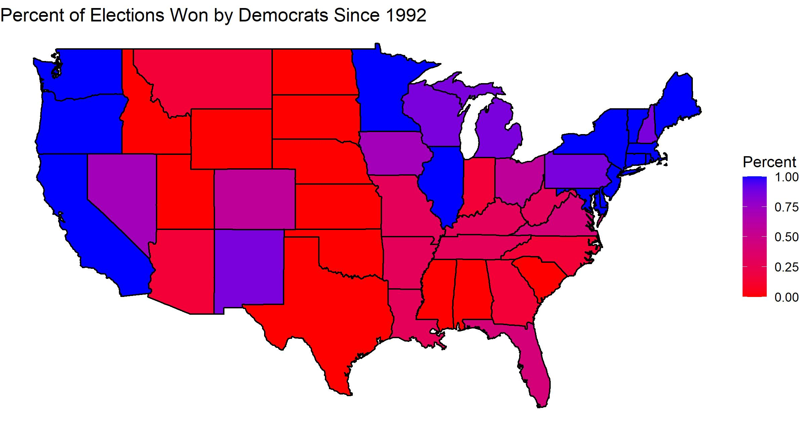
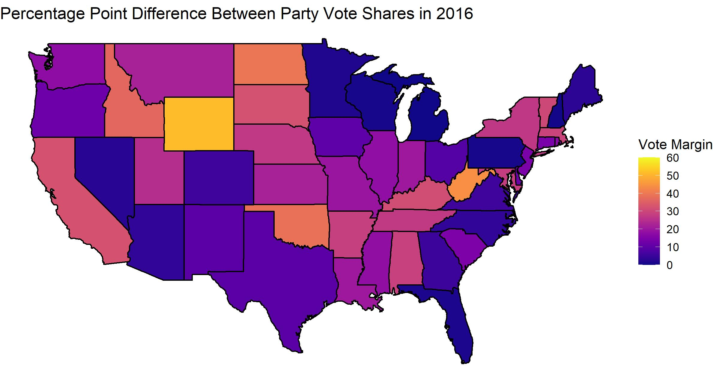

## Visualizig Swing States

Phrases like “swing states” and “battleground states” are commonly throw around in both the news media and in everyday conversations in the months leading up to an election. But what does it actually mean for a state to be a swing state? In this blog post, I am going to talk a little bit about what a swing state is in the US presidential election, why they are so important, and what states you should keep an eye on going into the election this year. 

The terms “swing states” and “battleground states” can be used interchangeably to refer to states in which either political party could win the presidential election. Although theoretically all states could be won by either party, some states are essentially guaranteed to be won by either the Democrats or the Republicans. For example, in the map shown below, 16 states voted exclusively for Democratic candidates over the past 28 years. These states are shown in blue, while states that voted exclusively for Republicans over the same time period are red. Assuming no major demographic or political transformations in these states, it is fairly safe to assume that they will also vote along the same party lines in 2020.

I just want to point out that although there’s no empirical reason for me to use 1992 as a starting date, I wanted to pick a range that seemed to have minimal variation in the demographics and politics of states, while also having enough data points to compute somewhat meaningful averages.

The states that are especially interesting to note in the above map are the purple states. These states are ones in which neither party has won a obvious majority of the elections over the past 28 years. These states also tend to be ones in which the vote margin between parties is low. The map below shows the absolute value of the average vote margin for either party in the state. States that are more purple had a lower average vote margin, meaning that it would take a smaller percentage of the vote to swing the election there. 

That’s what makes these states so important: since these states can be flipped from one party to another, it makes a lot of sense for candidates to spend a lot of time, energy, and money there to try to push the vote margin over the edge. This makes these states especially relevant in election years, which is likely a good thing for them, but it also means that other states receive less attention. As the Washington Post pointed out in an article this past week, the wildfires currently raging across the west coast are timely and unfortunate example of this. California, as an overwhelmingly Democratic state, has received very little attention from the president even as fires have raged there, while his mentions of swing states have actually increased over the past month.  

So what are the key swing states to keep an eye on in 2016? Here is a similar map to the one above, except this one only shows vote margins from 2016. 

In 2016, four states were won by a vote margin of less than 1 percentage point: Michigan, New Hampshire, Pennsylvania, and Wisconsin. As a result, these are going to be some of the most targeted states in 2020. After Wisconsin, the states with the next tightest margins are Florida, Minnesota, Nevada, and Maine. 