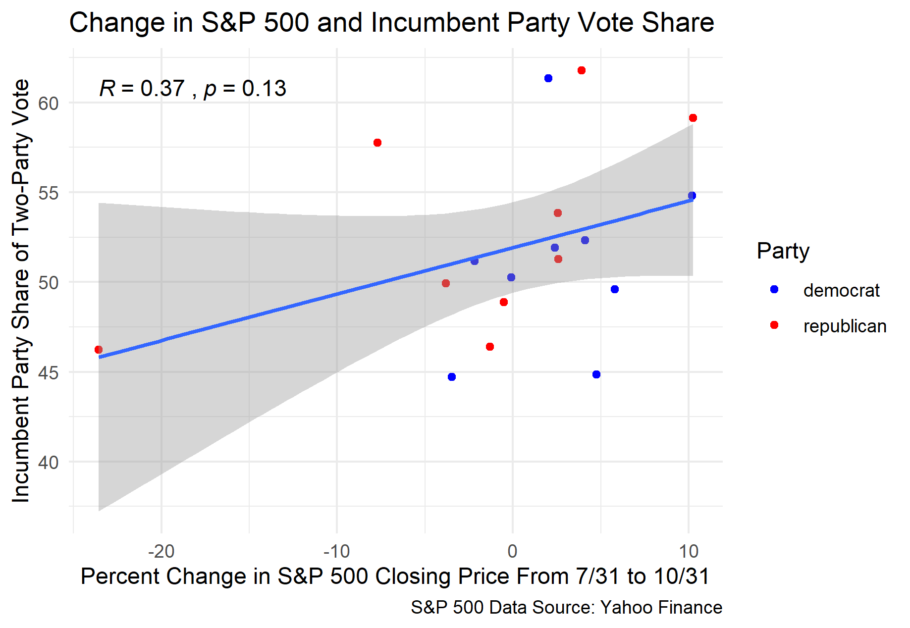
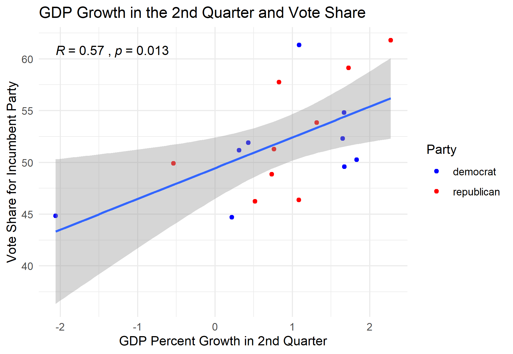
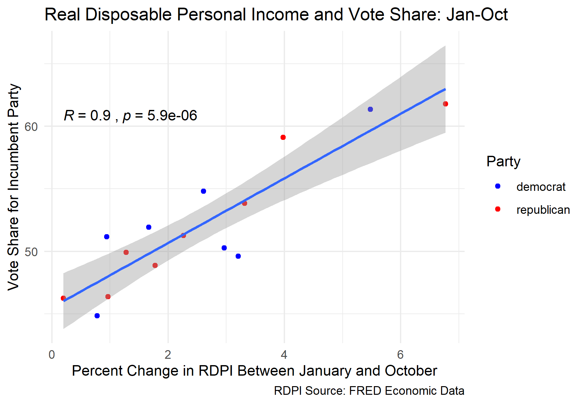
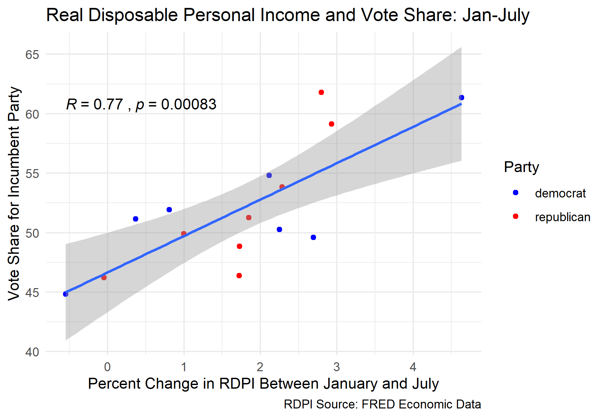

### The Economy and the Election - 9/19/20

In a townhall with voters on ABC earlier this week, George Stephanopoulos asked President Trump about the recovery of the economy, and specifically about his claims that the stock market gains have been beneficial to the general public. In response, President Trump doubled down on his argument:

“Look, we’re having a tremendous thing in the stock market, and that’s good for everybody. But people that aren’t rich own stock, and they have 401(k)s. You take a look at the 401(k)s, they’re in many cases better than they were before the pandemic came.”

Before diving into the more general argument and strategy here, it’s important to acknowledge the inaccuracy in this tweet: not all Americans own stocks. In fact, only about half of Americans own any stocks[*](https://nymag.com/intelligencer/2020/09/trump-town-hall-k-shaped-recovery-stocks-owned-by-everybody.html). 

Regardless of the inaccuracies, this focus on stock market gains has been a key pillar of the Trump campaign. President Trump has frequently Tweeted about gains in the stock market, and he did so just the day before his townhall:

“Great, Just Out! 51% Approval Rating in Rasmussen Poll. 95% in Republican Party. Stock Market up BIG today. Will I ever be given credit for the Markets and Economy? Next year will be BIG!”[*](https://twitter.com/realdonaldtrump/status/1305512070683619328)

This heavy focus on the stock market seems to be a strategy, or at least a bet, for the Trump campaign. They are hoping that Americans will see these gains in the stock market as a reflection of Donald Trump’s economic policy, and thus vote for him. From a historical perspective, these assumptions are reasonable. According to the brokerage firm BTIG, the incumbent party has won the election 90% of the time when the S&P 500 has positive gains in the three months before the election[*](https://www.wsj.com/articles/the-stock-market-is-a-strong-election-day-predictor-11599490800). I attempted to recreate this analysis by plotting the percent change in the S&P 500 closing price from the last day in July to the last day in October against the incumbent party vote share in the election.

Although the data I used only goes back to 1948, and I’m not sure exactly what metrics and dates were used to calculate S&P 500 growth in the original analysis, a similar relationship seems to exist in my data. The incumbent won the election eight times out of ten when the S&P 500 was positive for the three months before the election. However, there is a relative weak correlation between the two variables, with a correlation coefficient of only 0.37. Additionally, when this data is used to generate a linear regression model, the mean squared error (MSE) is 4.87. How do these correlation and error values compare with other economic variables?

First, let’s take a look at a commonly used measure of the economy: GDP growth. In many predictive models of presidential election outcomes, GDP growth is used as a measure of how the economy is doing under a president. More specifically, GDP growth from the second quarter of the election year has been shown to be a strong predictor of the popular vote share for the incumbent party candidate. Election year growth is more valuable than other years for correctly predicting vote shares because people (voters in this case) have a tendency to substitute the most recent experiences for the entire timespan when making evaluations[*](https://hollis.harvard.edu/primo-explore/fulldisplay?docid=TN_cdi_gale_infotracacademiconefile_A354446646&context=PC&vid=HVD2&search_scope=everything&tab=everything&lang=en_US). I have plotted the relationship between election year GDP growth and the vote percent for the incumbent party below. 

Although this relationship between GDP growth and the election outcome is both useful and interesting, the correlation is still relatively limited, with a coefficient of 0.57. The MSE for the regression model based on this data is slightly better than that for the S&P 500 model at 4.20, but neither models are particularly precise in their estimates. As a result, I decided to explore the relationship between other economic indicators and the vote share to see if any other variables were better predictors. One issue I encountered while looking for data to use was that very few data sets had both the necessary time scale and monthly data. However, FRED Economic Data had a data set that included monthly real disposable personal income (RDPI) from 1959 to 2020[*](https://fred.stlouisfed.org/series/DSPIC96).

Using this data set, I plotted the percent change in RDPI over different time intervals against the vote share for the incumbent party candidate. After initially finding a significant positive correlation over the same periods used for the S&P 500 and GDP growth, I decided to explore how the correlation changed by using different time intervals within the election ear. The most significant correlation I found was that for the change in RDPI from January to October, with a correlation coefficient of 0.9. When a linear model is generated with this data, the mean square error (MSE) is 2.24, which is nearly half of the MSE values for the GDP growth and S&P 500 growth. This relationship is plotted below.

It is interesting to consider the reasons why RDPI over the 10 months prior to the election would be the best predictor of the popular vote share for the incumbent party, at least out of the different models we have generated here. One possible explanation is that RDPI is a more accurate indicator of average quality of life for Americans. Assuming that an increase in RDPI produces the increase in popular support for the incumbent party (which is entirely an assumption, and maybe not a fair one), candidates like Trump may have more success with promoting policies and touting accomplishments related to increasing RDPI as opposed to GDP or the stock market. Since transfer payments are included in RDPI, it may be in Donald Trump’s best interests to continue pushing for stimulus checks and other similar programs.

Unfortunately, a linear regression model based on this data would not be suitable for predicting the election outcome this year, since the most recent available RDPI data from this year comes from July. When using the RDPI data from January to July instead of October, there is still a strong positive correlation with the vote share for the incumbent party, with a correlation coefficient of 0.77. When a linear regression model is generated using this data, the MSE is 3.25 and the average out-of-sample error is 3.01.

Using this model and the most recent RDPI data from July 2020, I was able to generate a prediction for President Trump’s share of the popular vote for the coming election. The model predicted that Trump will win the election with 67.41% of the popular, which would be a landslide victory. The upper bound of the prediction interval was 78.33%, and the lower bound was 56.49%. These results seem surprising: based on the massive decline in GDP growth this year, shouldn’t we also expect to see a decline in RDPI and thus in the percent of the popular vote for the incumbent party? Although the economy as a whole may have contracted, RDPI actually expanded over the first half of the year by 6.77%. This makes sense when you consider the fact that RDPI includes transfer payments, such as the stimulus checks. However, this expansion of RDPI over the first half of the year is unprecedented, with the next highest value in the data being 4.63%. Since the value for this year is so extreme, it is possible that the model may be significantly more inaccurate than it otherwise would have been. 

 

