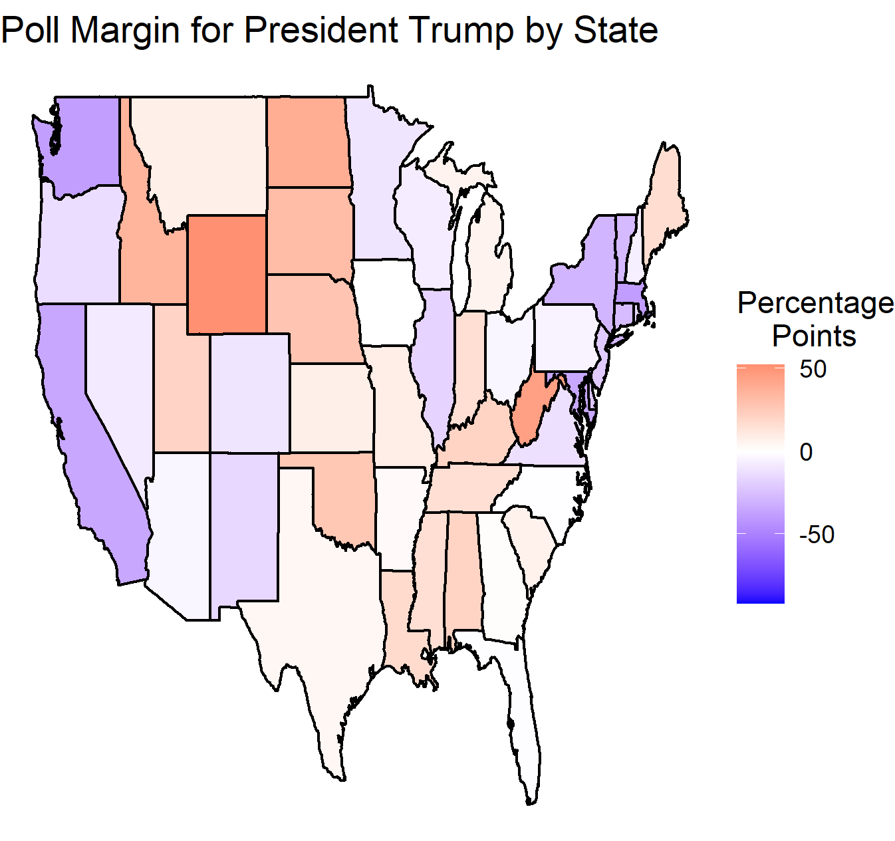

### E Pluribus Unum: Combining State Polls - 9/26/2020

When polls are mentioned in the news, they usually fall into one of two categories: national polls or swing state polls. Even though polls are conducted in most states (although not all), the spotlight usually falls on polls for the most highly contested states and the national polls. As I discussed in my week 1 blog post, this focus on swing states makes sense, as they can decide the outcome of the election. However, the polls from smaller states and those that are not considered swing states could also be useful for predicting the outcome of the election. This week, I am going to be looking at how the national polls for the presidential election vary from a poll-based model that incorporates data from all 50 states and DC. 

I’d like to start by just looking at the current national polls for the presidential election. According to RealClearPolitics’ (RCP) calculated [polling average](https://www.realclearpolitics.com/epolls/2020/president/us/general_election_trump_vs_biden-6247.html), Joe Biden is currently averaging 49.6% in the most recent national polls, while Donald Trump is averaging 42.9%. This average includes polls conducted from 9/19 to 9/23. There is some slight variability among these polls, but Joe Biden has a higher share of the vote in all of them. 

To build a model using state level polling data, I had to manually collect the state polling averages from RCP. Many states had a decent number of polls, or at least enough for RCP to calculate a polling average. For states with polls but no polling average, I just used whatever poll was available or the most recent poll. However, some states did not have any polls, such as Idaho, Illinois, Nebraska, and North Dakota. Although I was surprised that there were no polls available for Illinois, most of the other states’ lack of polls made sense, as they tended to be less populated and highly partisan. Since I did not have poll data for these states, I had to replace it with vote percents from the [2016 election](https://www.npr.org/2016/11/08/500927768/2016-presidential-election-results-for-each-state). Although this is not necessarily the most accurate substitution, most of the states without polls were both small and highly partisan, so I doubt it will have much of an impact on my overall prediction. 

With all this data collected, along with population data from the [Census](https://www.census.gov/newsroom/press-kits/2019/national-state-estimates.html), I was able to calculate some new variables for each state, such as the current poll margin for Trump and the expected number of votes for each candidate. I have mapped the vote margin by state below.

The variable that is the most useful for my analysis is the number of projected votes per state based on the polls. With the sums of these projected vote counts, I then calculated the projected percent of the vote for both Biden and Trump at a national level: 49.8% and 42.7%, respectively. These numbers are surprisingly close to the national polling averages. This is interesting when you consider the fact that the sample size for the combined state average would end up being much larger than that for the national average. However, it is important to acknowledge that by using population to scale up the number of votes in the state, I am essentially assuming 100% voter turnout. This is unrealistic, but it presents an interesting opportunity for a future blog post to redo this analysis by incorporating past voter turnout rates by state. 
