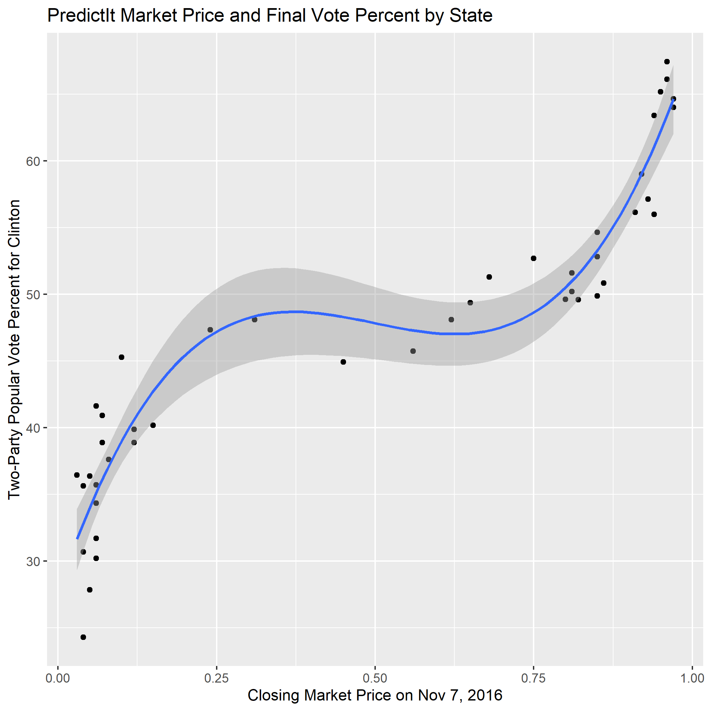

## Using Prediction Markets to Predict Vote Percent - 10/3/2020

In recent years, prediction market sites like [PredictIt.org](https://www.predictit.org/) have become a popular way of betting on the outcome of events like elections, but they are also useful for evaluating a candidate’s chances of winning. When you make a prediction on the site that a candidate will win, you buy a contract at the current market price with the expectation that if that candidate wins, the contract will pay out one dollar. With hundreds of thousands of people buying and selling contracts for the outcome of the election, the predictions inevitably reflect the different beliefs and information that people have about the election. Although the market price does not explicitly tell you anything about what the vote share in the election could be, this week I decided to explore the relationship between the market price and the final vote share to see if market price could be used to accurately predict the vote share in the election.

Since sites like PredictIt.org are relatively new, they do not have detailed historical data for past elections. As a result, I decided to just use the state-level data from the 2016 election. Although I was unable to find market data for 6 out of 50 states in 2016, the rest of the states had market data that went back about 90 days before the election. Taken as individual predictions, the markets were pretty accurate overall, having correctly predicted 39 out of 44 elections on the day before election day. I downloaded the data for each of these individual markets, and then combined the data into a more comprehensive dataframe. I then merged the data with the two-party popular vote by state, so that I was able to plot the market price from any specific day and the final vote percent. Here’s a plot generated with the market data from the day before the election:

As you can see, there is a clear correlation in the data, but it is not linear. Instead, I had use a polynomial regression to get a line that fit the data. This relationship makes sense: candidates that are very likely to win or lose by a significant margin are going to have extremely inflated or deflated prices, while races with more uncertainty will have market prices closer to $0.50. This model seems to fit the data from 2016 fairly well with a multiple R-squared value of 0.8862 and a mean squared error of 3.11. With these indicators that market price could be a good predictor of vote percent, I decided to use this model to predict the two-party vote share for the 2020 election by state.

However, since the most recent data available from PredictIt for the 2020 election is Oct. 1, I had to adjust my model to use data from Oct. 1, 2016 instead. This actually increased the multiple R-squared to 0.9028 and lowered the MSE to 3.00. With this adjustment made, I was able to plug in the 2020 market prices for each state to calculate the expected two-party vote share for each state.  Here’s what the model predicts for the outcome of the election in each state:

It’s interesting to note that this map is very different from the one that just uses the prediction market prices to predict the outcome of each state, which can be seen below. A few notable changes include Texas, Florida, and Michigan, which would have a big impact on the outcome of the election in terms of the electoral vote. This suggests that although the model will likely give us a reasonable estimate for the popular vote, it may not necessarily be the best for predicting the outcome of any one specific state as a result of error in both the markets and the model. However, when the estimated vote percentages for each state are combined for the country as a whole, it is possible that this model will be an even better predictor.

To calculate total vote percentages for the whole country, I downloaded data for the historical voter turnout rates by state[*](http://www.electproject.org/home/voter-turnout/voter-turnout-data), and using this along with population data, I was able to calculate the total expected number of votes for each candidate. Based on this data, it is expected that Biden will win the election with 53.1% of the two-party popular vote, while Trump will get 46.9% of the vote. These results seem very reasonable, much more so than some of the other models I have created, such as the one based on change in real disposable personal income. 
