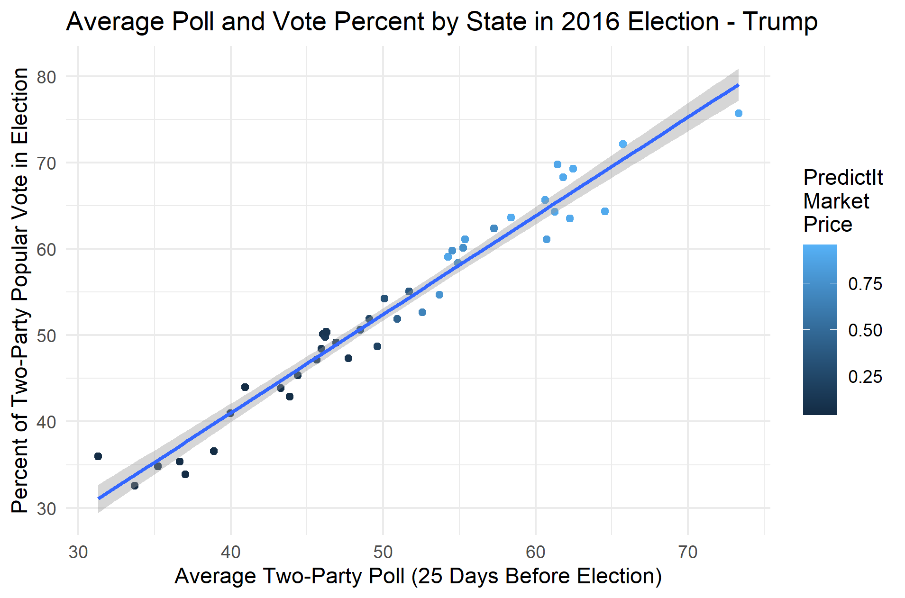
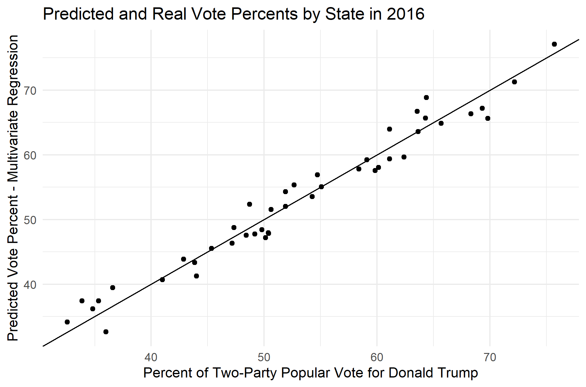

## Developing the Model: Adding Polling Data - 10/10/2020

Although I was pleased with the model I generated last week using only prediction market data, I wanted to see if I could potentially improve the fit of the model with the original data by incorporating polling data as well. I wanted to test three different models: just market data, just polling data, and market and polling data combined. For the sake of comparison, I used data specific to the 2016 Trump campaign when building these models. 

To test the model that just used market data, I copied the model that I generated last week, which was a polynomial regression model that used the PredictIt closing market price to predict the vote percent. I made two changes to this model: I changed the date of the data to October 14, 2016, which was 25 days before the election, and I also adjusted the price to be in terms of the two major parties (ie. two-party Democratic price = Democratic price/(Democratic price + Republican price)). I made this second adjustment because I noticed that the closing prices didn’t always add up to $1, and I didn’t want these variations to impact the model. Since the market price can be interpreted as an expected probability of winning, I think it is reasonable to adjust the values in this way. This model has a root mean squared error (RMSE) of 3.45 and an adjusted R-squared value of 0.8938. When cross-validation is used to test for out-of-sample error with 1000 resamples of the original data, the average RMSE is 3.83.

Next, I wanted to test how a model based only on average polling data would perform. Like with the market data, the polling data was also selected from 25 days before the 2016 election. I decided to also convert the average polling data to a two-party variable so that different levels of support for third-party candidates wouldn’t produce unexpected variations in the model. The two-party polling data and two-party vote percent data fit a linear regression model very well, with an RMSE of 2.29 and a R-squared value of 0.9556. Additionally, the average RMSE for out-of-sample data is 2.44. This model fits the data significantly better than the market model. Here is a plot of the polling data and vote percent with the regression line:

However, the model can actually be slightly improved in accuracy and fit when the two variables are combined. When a multivariate regression model is generated by combining the two models described above, the RMSE decreases to 2.14 and the adjusted R-squared increases to 0.9585. The average out-of-sample RMSE was very close to that for the poll-based model, at 2.42. None of these changes represent serious gains in accuracy or fit, but these small improvements may make it worth it to also include the PredictIt market price in my model. Here is a plot that compares the predicted values to the actual values for the two-party vote percent in the 2016 election:

With these three different models in mind, I decided to update my weekly prediction using the new model that combined polling and market data. The new polling data I used comes from [FiveThirtyEight’s polling averages](https://projects.fivethirtyeight.com/polls/president-general/national/), and I just used the latest poll results for states where there was no average. I followed the same methodology as last week to calculate national percent of the vote, where the number of votes in each state is calculated by multiplying the expected vote percent by the expected number of voters. However, when I plugged the data in for Trump and then for Biden, the sum of the values was over 100. To get around this issue, I made two-separate models: one for Biden based on the data for Hillary Clinton in 2016, and one for Trump based on the data from his 2016 run. Although I wasn’t sure if doing it this way would work, the vote percents I calculated did add up to 100. This makes sense when you consider the fact that the data used to train the two models are complementary. Here are my predictions for this week:

Biden: 52.2%
Trump: 47.8%

These results are still fairly close considering how far ahead Biden seems to be in many of the polls and prediction markets. However, Trump still maintains a strong lead in many red states, possibly offsetting some of the lead Biden currently has in the swing states. As we approach our final predictions, I would like to continue to develop and refine this model. The extreme outlier data points of 2020, such as those pertaining to the economy, have made other approaches based on these variables less appealing to me. I like the fact this model I have developed using polls and prediction market data incorporates those other variables indirectly, but the data points still lie within the realm of where they were in past years. 
