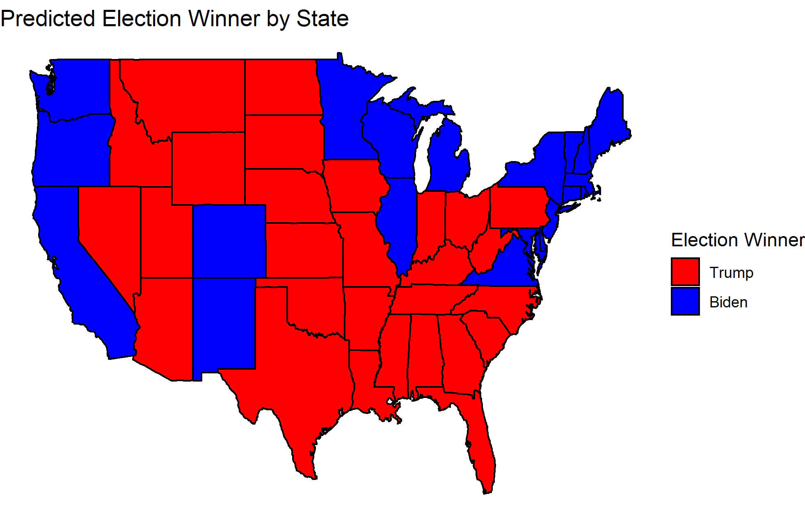
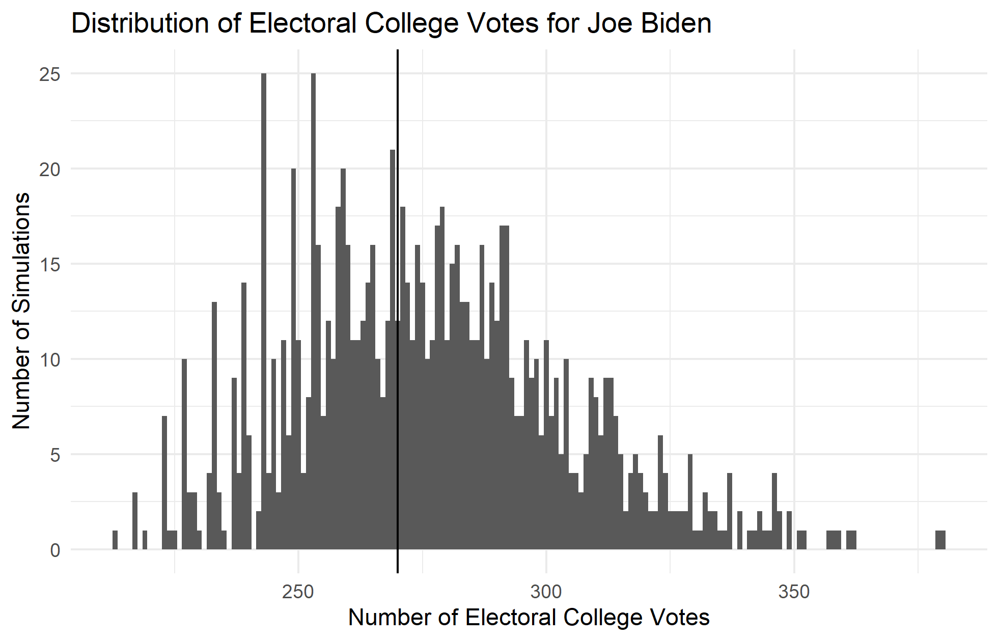
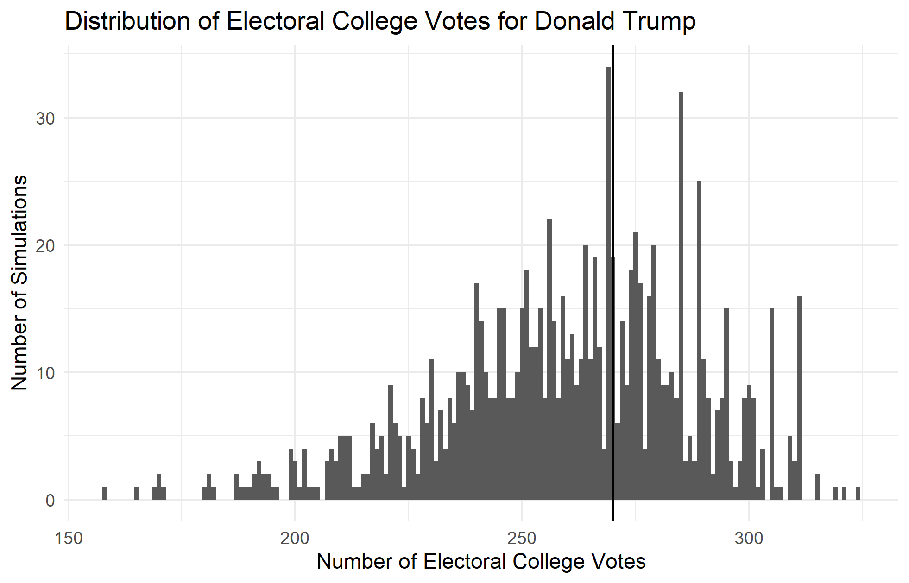

## The Probability of a Biden Victory - 10/17/2020

In making my predictions this week, I decided to continue to develop the prediction model that I have been working on for the past two weeks. As I wrote about in my last blog post, this model, which combines polling data with prediction market data from PredictIt.org, was slightly more accurate with in-sample data than the two other models that used just polling data and just prediction market data. There was also a slight decrease in out-of-sample error, but this change was very small. Although combining both prediction market data with polling data did not seem to drastically improve the model, the slight increases in fit and accuracy that resulted from the multivariate regression led me to decide that it was worth it to include both sets of data. 

I also considered adding another variable to my model this week, such as demographic data. Although it would be interesting to see how variations in turnout for different groups could affect the predicted share of the popular vote, I decided to focus on developing this existing model by using it to generate a probabilistic prediction for the election.

First, let me update my point predictions for the share of the two-party vote that each candidate will receive. No fundamental changes were made to the model itself this week, although I found a CSV file on the [FiveThirtyEight website](https://data.fivethirtyeight.com/) that includes all of the average polling data that I have been manually scraping. Below are my predictions for each candidate, along with a map of the predicted winners of each state:

Biden: 52.3
Trump: 47.7

These results are a slight increase in the share of the vote for Biden. It is interesting to note, however, that the model predicts that Biden will lose important states like Pennsylvania, Ohio, Florida, and Arizona. Although Biden has widened his lead over Trump in terms of the predicted two-party popular vote, how will this translate into a probability of him winning the election?

In order to calculate this, I used the predicted values of each state’s two-party vote percent along with their prediction intervals to generate distributions that could then be sampled. If the predicted value is the mean of the distribution of possible predictions, and the prediction interval is equal to 1.96 standard deviations in either direction of the mean, then a normal distribution can be generated for each predicted value. Using this strategy, I was able to simulate 1000 possible outcomes of the election by sampling a new value from each state’s distribution. I awarded all of a state’s electoral college votes to the candidate if they won the predicted popular vote and then calculated a national sum of the electoral votes for each simulation. The distributions of electoral college votes for each simulation are plotted in the histograms below, where the cutoff to win the election is shown by the vertical line at 270:

If each simulation represents a possible election outcome, then the percent of elections won can be thought of as the probability of a candidate winning the election. Thus, the proportion of the histogram above the line at 270 are the candidate’s chance of winning the election. This gives Joe Biden a 56% chance of winning the election and Trump a 37.4% chance. It is important to note, however, that even though the point predictions add up to 100, the probability predictions do not because of sampling variation. I would expect this gap in probabilities to decrease with an increase in the number of simulations. 

Going forward, I would like to explore how the predicted values and probabilities for each candidate have changed over the past few weeks. Additionally, I would like to explore how the in-sample and out-of-sample error change for the model in the weeks leading up to the 2016 election.
