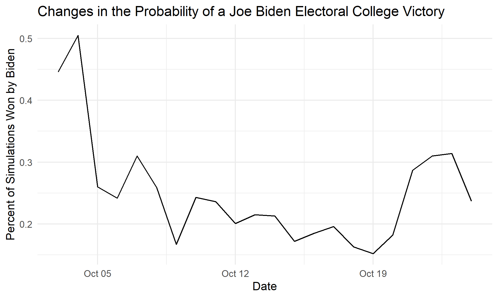

## Changes Over Time - 10/24/2020

For this last blog post before making my final election prediction next week, I decided to explore how the model has changed over time, both in terms of its fit and the predictions it produces. First of all, I am interested to see if the model’s in-sample root mean squared error (RMSE) changes if I use different dates from 2016. I suspect that the model will see an improvement in fit as the election date approaches. Although I would also like to test the out-of-sample error, running an out-of-sample simulation for each day would be very time consuming, especially since I will already be doing something similar to see how the probability of a candidate’s victory changes over time. Additionally, I would like to better understand how the predicted two-party vote percent for each candidate has changed over the last few weeks, along with the corresponding probability prediction.

I would like to begin by discussing how I used the model I have been developing to calculate values for different days. For the past few weeks, I have been manually updating the variables for the model so that it used the most recent poll and prediction market data to predict the outcome of the election. However, in order to get the RMSE values and prediction results for every day over a time period, I copied these different sets of code into functions. These functions allow me to quickly calculate the desired values by just plugging in a specific date, and they can also be mapped onto a dataframe with a list of dates. The one tricky thing about creating the functions was that the election in 2016 was on November 8th, so in order to make sure I was using data from the same number of days before the election in both training the model and making predictions, I had to also include a five day adjustment for the 2016 dates.

The function that calculates the in-sample RMSE for each day takes a date from before the 2016 election and filters the polling and market data for this day. These data are then plugged into the regression formula, and the RMSE is calculated based on the residuals. When plotted, as seen below, the RMSE values trend downwards, especially over the last few days before the election. Although in-sample RMSE is not as valuable of a potential accuracy indicator as an out-of-sample error test, the improvement in fit over time is promising, as it seems to suggest that the model could make an even better prediction as the election approaches.

I also created a separate function to predict the vote percent and one to predict the probability of winning the election. Both of these functions also filter the data based on the input date and generate models with this data. As I mentioned before, the 2016 data are filtered for a date five days earlier than the 2020 date. Since each candidate has a separate but complementary model for predicting the vote percent, I just used Joe Biden’s model to predict the vote percent and the probability of winning. One of the nice things about these functions is that I can just import the new data for the week, plug the date into the function, and get the latest predictions for the outcome of the election. This week my predictions are as follows:

Predicted Two-Party Vote Percent:
- Joe Biden: 51.7%
- Donald Trump: 48.3%

Probability of Winning the Electoral College:
- Joe Biden: 23.7%
- Donald Trump: 76.3%

I would just like to point out the fact that these numbers are very different than the ones from last week because I made a mistake in my predictions last time by using the wrong date. The results for this week are very interesting: even though Joe Biden is predicted to win the popular vote, his probability of winning the electoral college is very low. This seems counter-intuitive until you realize that Hillary Clinton had 51.1% of the two-party popular vote and still lost the election. I have plotted both the change in predicted vote-percent and probability of winning for Joe Biden below:

One factor that may have contributed to the decline of Joe Biden's probability of winning is the market price in Florida, which is a state that Hillary Clinton lost in 2016. The market price for a Donald Trump victory in the Florida prediction market has increased by 15 cents over this time period, and he is now leading in the state. Although Joe Biden can still win the election according to my model, winning states like Florida will obviously be crucial on his path to victory.

